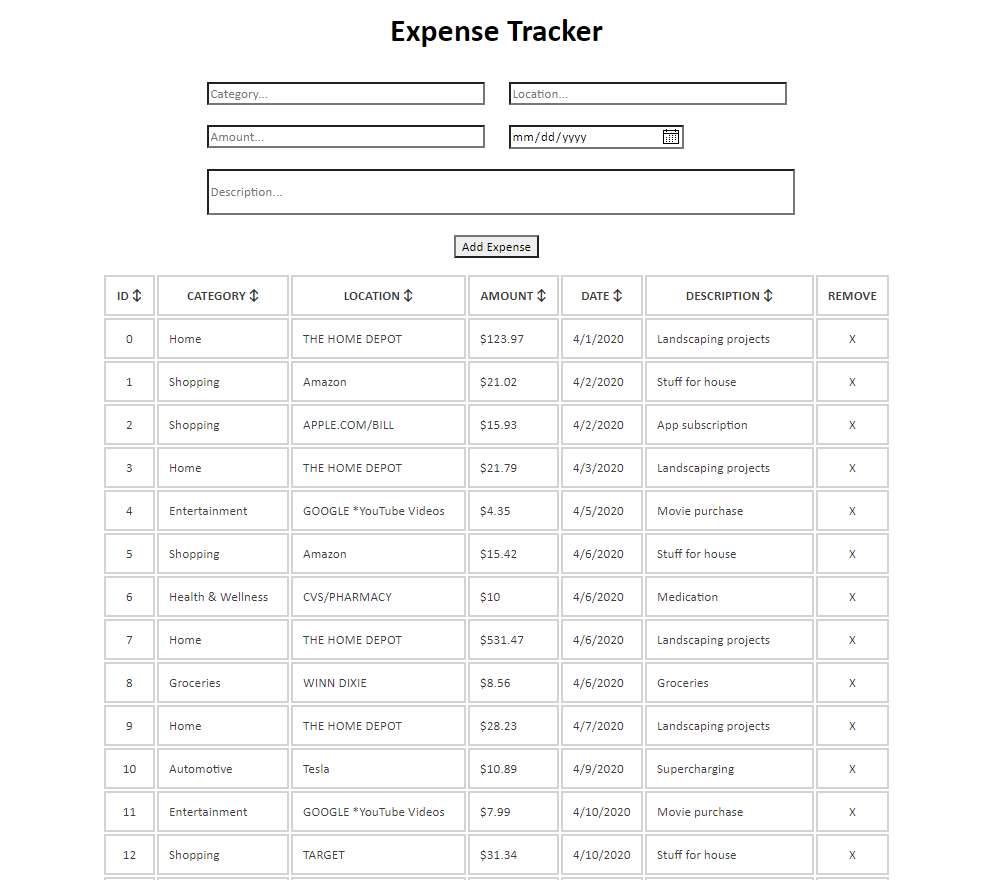

# Vanilla JavaScript Expense Tracking App

*A simple expense tracking app written in pure JavaScript, HTML, and CSS*

Use it [here](https://kendric84.github.io/ExpenseTracker/)

## Summary
A simple expense tracking app that allows you to add expenses, tracking the category of the expense, the location, amount, date, and a description.

The app will also pre-populate drop-down options for category and location based on data already entered, making it easy to record multiple epenses from the same location.

The table can be sorted by any column and individual items can be removed.

To better illustrate the features, sample data can be loaded.

## Author
- **Graham Smith** - Full-Stack Software Developer